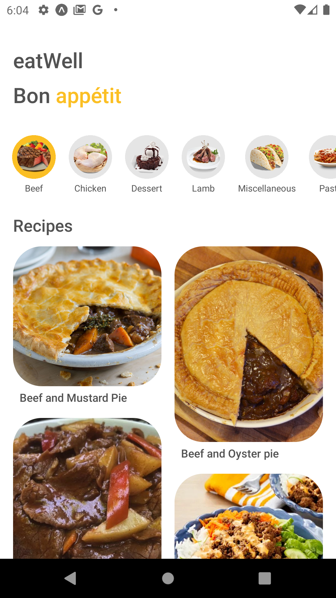
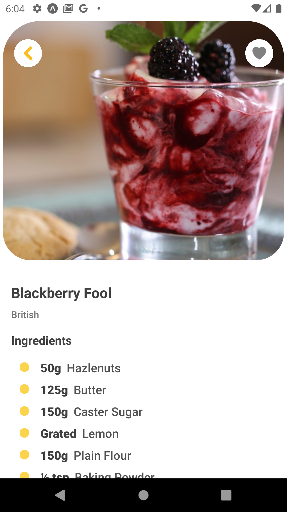

# eatWell

This is a API little projet to work with react native and an API. It's a recipe app, that you can find a lot of recipes of meals and desserts from different contries.

### You will find:

- A carousel with categories of meals and desserts.
- A list of recipes of each category of meal.
- An image of the each recipe
- The name of the recipe

Each recipe has:

- An image
- The name of the recipe
- The origin of the recipe
- All ingredients for the recipe
- Method of preparation

I have used the API The meal database
https://www.themealdb.com/api.php

## For this app, I have installed:

- react-navigation
- axios
- react-native-screens
- react-native-safe-area-context
- tailwindcss 3.3.2
- react-native-heroicons
- react-native-responsive-screen
- react-native-seoul/mansory
- react-native-reanimated
- expo-image
- expo-linking

Here some images of app

  
  
  
 

